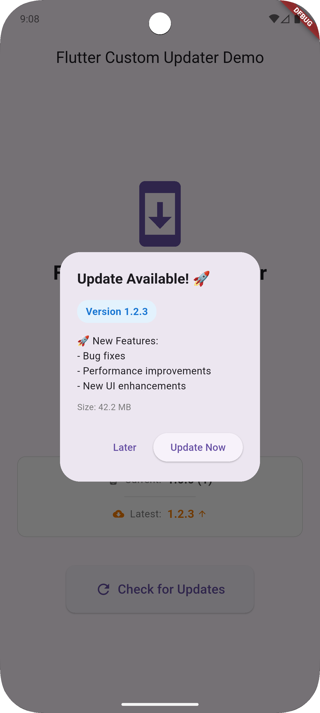
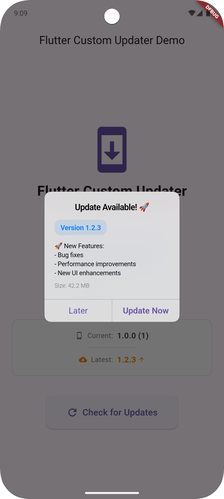
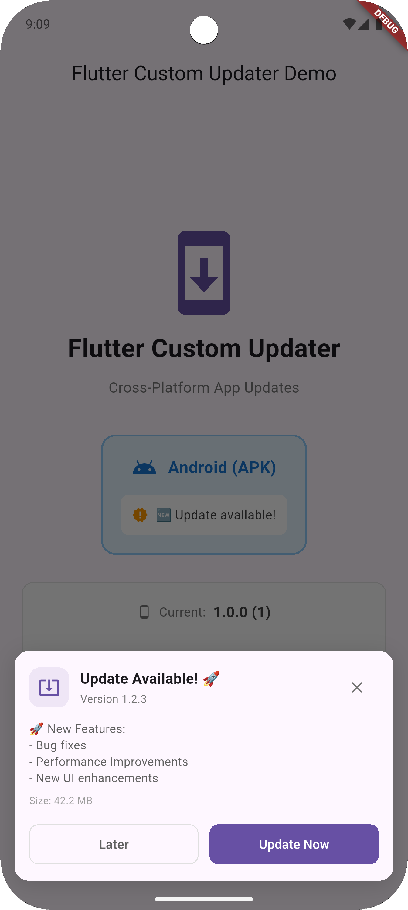
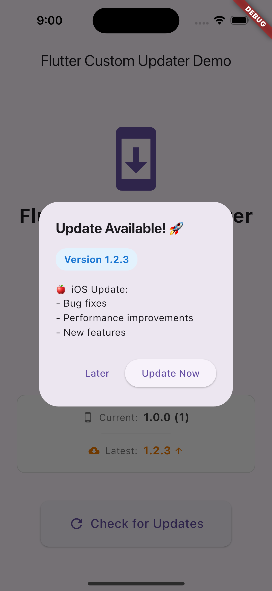
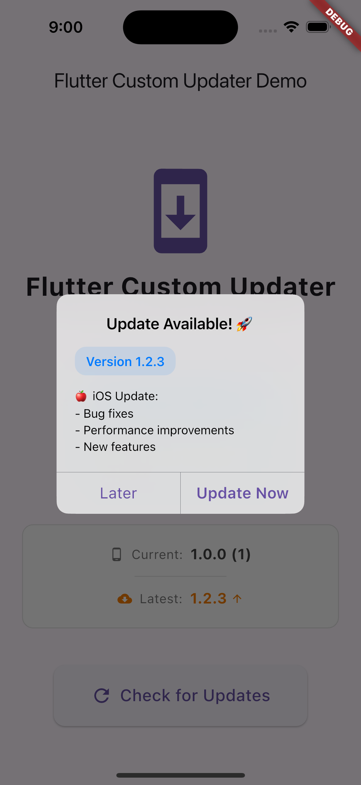
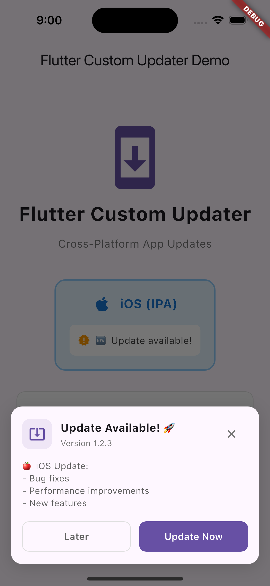

# Flutter Custom Updater

📦 A Flutter package for internal app updates (APK & IPA). Update your apps from your own server without App Store or Play Store. Built for self-hosted, enterprise, and private app distribution.

## ✨ Features

### 🌐 Cross-Platform Support

| Platform | Format | Installation Method                                | Status       |
| -------- | ------ | -------------------------------------------------- | ------------ |
| Android  | APK    | Automatic download and installation                | ✅ Supported |
| iOS      | IPA    | Enterprise distribution via itms-services protocol | ✅ Supported |

### 🎯 Core Features

- 🎨 **Three Dialog Styles** - Material, Cupertino, and modern Snackbar designs
- 📱 **Cross-Platform** - Works on both Android and iOS
- 🔄 **Automatic Updates** - Version checking, downloading, and installation
- ⚡ **Force Updates** - Require critical updates with non-dismissible dialogs
- 🌐 **Language Header Support** - Send custom language codes in API requests
- 🎯 **Fully Customizable** - Colors, text, styles, and callbacks
- 🚀 **Self-Hosted** - Complete control with your own update server

## 📸 Screenshots

|  Platform   |                         Material                          |                         Cupertino                          |                         Snackbar                          |
| :---------: | :-------------------------------------------------------: | :--------------------------------------------------------: | :-------------------------------------------------------: |
| **Android** |  |  |  |
|   **iOS**   |      |      |      |

## 📦 Installation

Install directly from GitHub (always get the latest):

```
dependencies:
  flutter_custom_updater:
    git:
      url: https://github.com/vatanakchamroeun/flutter_custom_updater.git
```

or install to your local

```
dependencies:
  flutter_custom_updater:
    path: ../flutter_custom_updater
```

## ⚙️ Setup

### 🤖 Android Setup

And add these permissions to your android/app/src/main/AndroidManifest.xml:

```xml
<manifest>
    <!-- Add these permissions -->
    <uses-permission android:name="android.permission.INTERNET"/>
    <uses-permission android:name="android.permission.REQUEST_INSTALL_PACKAGES"/>
    <uses-permission android:name="android.permission.WRITE_EXTERNAL_STORAGE"/>
    <uses-permission android:name="android.permission.READ_EXTERNAL_STORAGE"/>

    <application>
        <!-- Add FileProvider for Android N+ -->
        <provider
            android:name="androidx.core.content.FileProvider"
            android:authorities="${applicationId}.provider"
            android:exported="false"
            android:grantUriPermissions="true">
            <meta-data
                android:name="android.support.FILE_PROVIDER_PATHS"
                android:resource="@xml/file_paths"/>
        </provider>
    </application>
</manifest>
```

Create android/app/src/main/res/xml/file_paths.xml:

```xml
<?xml version="1.0" encoding="utf-8"?>
<paths>
    <external-path name="external_files" path="."/>
</paths>
```

### 🍎 iOS Setup

Edit ios/Runner/Info.plist and add this inside the <dict> tag:

```
<key>LSApplicationQueriesSchemes</key>
<array>
    <string>itms-services</string>
</array>
```

## 🚀 Usage

### Basic Example

```dart
// Server should return: "forceUpdate": true
// The dialog will hide "Later" button and prevent dismissal
import 'package:flutter_custom_updater/flutter_custom_updater.dart';

final updater = AppUpdater(
  context: context,
  config: UpdaterConfig(
    updateCheckUrl: 'https://your-server.com/api/check-update',

    // Optional: Add custom headers
    customHeaders: {'Authorization': 'Bearer YOUR_TOKEN'},

    // Optional: Customize dialog style
    dialogStyle: DialogStyle.snackbar, // material, cupertino, or snackbar
  ),
);

await updater.checkAndUpdate();
```

### Advanced Customization

```dart
final updater = AppUpdater(
  context: context,
  config: UpdaterConfig(
    updateCheckUrl: 'https://your-server.com/api/check-update',

    // Dialog Style
    dialogStyle: DialogStyle.material, // Choose: material, cupertino, or snackbar

    // Language (auto-detects from device if not provided)
    language: 'km', // example: 'en', 'km', 'zh', etc.

    // UI Customization
    dialogTitle: 'New Update Available',
    dialogContent: 'A new version is ready to install',
    updateButtonText: 'Update Now',
    laterButtonText: 'Later',
    allowDismiss: true,

    // Snackbar-specific customization
    snackbarBackgroundColor: Colors.white,
    snackbarIconColor: Colors.blue,
    snackbarDescription: 'Get the latest features and improvements',

    // iOS-specific
    iosInstallText: 'Preparing installation...\nPlease follow the prompts.',

    // Callbacks
    onNoUpdateAvailable: () => print('✅ App is up to date'),
    onError: (error) => print('❌ Error: $error'),
    onDownloadComplete: (path) => print('📥 Downloaded to: $path'),
    onInstallStart: () => print('🚀 Installing update...'),
  ),
);

await updater.checkAndUpdate();
```

## 🔧 Server Response Format

Your update check endpoint should return JSON in this format:

### Android Response

```json
{
  "status": "success",
  "code": 200,
  "message": "Update available",
  "data": {
    "has_update": true,
    "version": "1.2.3",
    "download_url": "http://your-server.com/downloads/app-v1.2.3.apk",
    "file_name": "app-v1.2.3.apk",
    "release_notes": "🚀 New Features:\n- Bug fixes\n- Performance improvements\n- New UI enhancements",
    "force_update": false,
    "file_size": 44231891
  }
}
```

### iOS Response

```json
{
  "status": "success",
  "code": 200,
  "message": "Update available",
  "data": {
    "has_update": true,
    "version": "1.2.3",
    "download_url": "http://your-server.com/ios/manifest.plist",
    "ios_manifest_url": "http://your-server.com/ios/manifest.plist",
    "release_notes": "🍎 iOS Update:\n- Bug fixes\n- Performance improvements\n- New features",
    "force_update": false
  }
}
```

### Field Reference

#### Required Fields:

| Field          | Type    | Description                                                                         |
| -------------- | ------- | ----------------------------------------------------------------------------------- |
| `has_update`   | boolean | Whether an update is available (defaults to `false` if missing)                     |
| `download_url` | string  | URL to download the APK or iOS manifest.plist (defaults to empty string if missing) |

#### Optional Fields:

| Field              | Type    | Description                                                  |
| ------------------ | ------- | ------------------------------------------------------------ |
| `version`          | string  | New version number to display                                |
| `release_notes`    | string  | What's new in this version (supports `\n` for line breaks)   |
| `force_update`     | boolean | Force the update (hides "Later" button, defaults to `false`) |
| `file_name`        | string  | Custom filename for downloaded file (Android only)           |
| `file_size`        | integer | File size in bytes - displayed to user (Android only)        |
| `ios_manifest_url` | string  | URL to .plist manifest for iOS enterprise distribution       |

### Platform Detection

The package automatically sends these headers with each request:

- `Current-Version`: The current app version
- `Platform`: Either "android" or "ios"

### Force Update

Set `force_update: true` in your server response to require updates:

```dart
// Your server should return this when force update is needed:
{
  "has_update": true,
  "version": "1.2.3",
  "force_update": true,  // This hides "Later" button and prevents dismissal
  "download_url": "https://your-server.com/app-v2.0.0.apk",
  "release_notes": "Critical security update. Please install immediately."
}
```

## ⚠️ Important Notes

### Android

- Users must enable "Install from Unknown Sources" to install APK files
- The app needs `REQUEST_INSTALL_PACKAGES` permission for Android 8.0+
- APK files must be signed with the same certificate as your published app

### iOS

- **Enterprise Distribution**: Requires an Apple Enterprise Developer Account ($299/year)
- **TestFlight/App Store**: For standard distribution, redirect users to TestFlight or App Store instead of using this package
- The manifest.plist file must be served over HTTPS
- Users may need to trust the enterprise certificate in Settings

## 🤝 Contributing

Contributions are welcome! Please read our [Contributing Guidelines](CONTRIBUTING.md) and feel free to submit a Pull Request.

## 📄 License

This project is licensed under the MIT License - see the [LICENSE](LICENSE) file for details.
